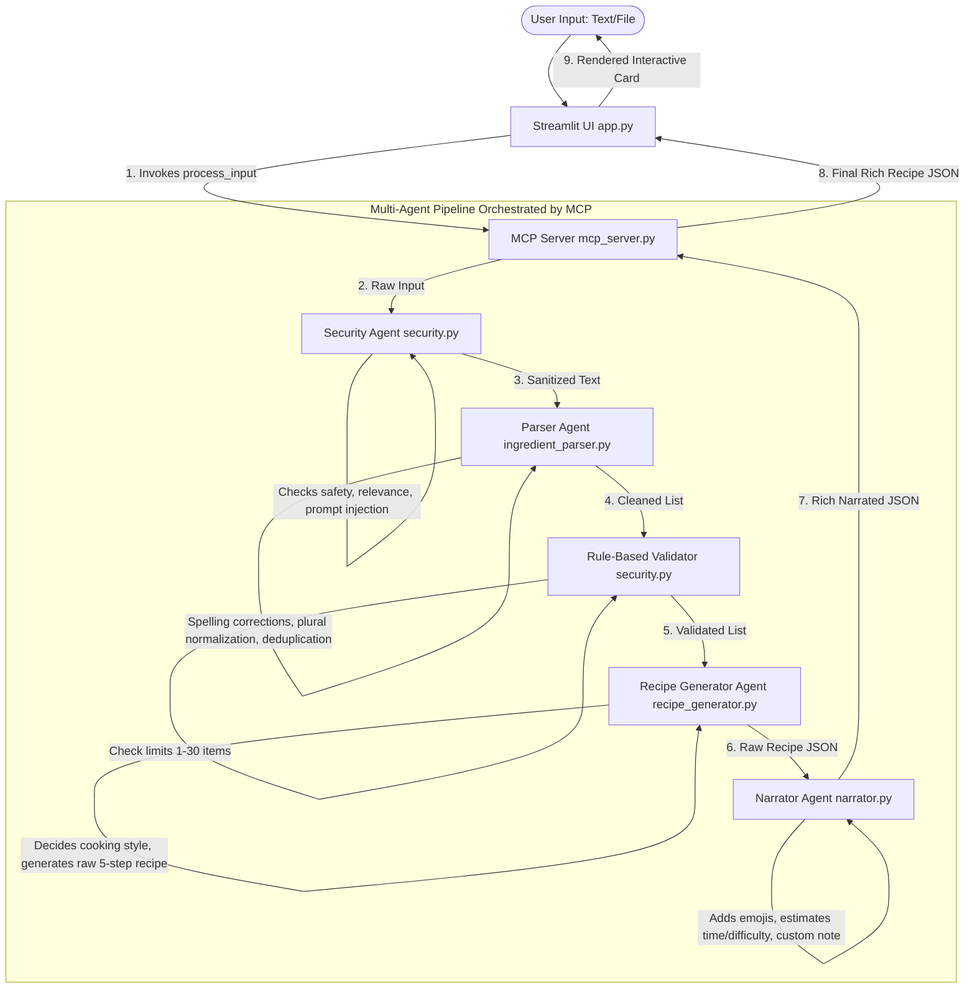
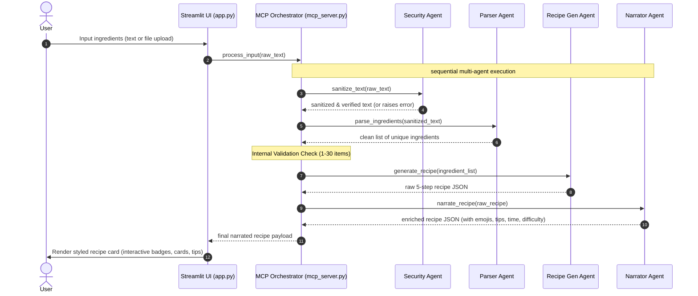

# 🍳 Chef AI – Multi-Agent Cooking System

Chef AI is a premium, multi-agent cooking assistant that transforms raw ingredient inputs into fully curated, narrated, and visually stunning recipe cards. The system leverages the power of Gemini models (`gemini-3.1-flash-lite` with structured output schemas) and coordinates a pipeline of specialized agents orchestrated through a central coordinator.

---

## 🏗️ Architecture & Orchestration

The core design follows an **orchestrated multi-agent pipeline** where a central **MCP (Model Context Protocol) Server / Orchestrator** controls the flow of data. Rather than agents communicating in an ad-hoc mesh, they are executed in a structured, sequential dependency pipeline. This ensures high predictability, safety, and strict compliance with the data contracts (Pydantic models) required at each stage.



---

## 👥 The 4 Collaborating Agents

Each agent has a singular, focused responsibility and is backed by a fallback system to ensure uninterrupted operation even during API issues.

### 1. 🛡️ Security Agent (`security.py`)
*   **Role**: Acting as the first line of defense.
*   **Key Responsibilities**:
    *   Detects and blocks prompt injections, HTML/JS scripts, and SQL injection payloads.
    *   Filters out vulgarity, harassment, and unsafe instructions.
    *   Determines if the request is **food-related**. If a user tries to chat about coding or politics, the agent flags it.
*   **Pydantic Schema**:
    ```python
    class SecurityCheck(BaseModel):
        is_safe: bool
        is_food_related: bool
        reason: str
        cleaned_text: str
    ```
*   **Fallback**: Standard regex sanitization stripping tags and known script prefixes.

### 2. 🔍 Parser Agent (`ingredient_parser.py`)
*   **Role**: Input normalizer and cleaner.
*   **Key Responsibilities**:
    *   Splits text by common delimiters (commas, newlines).
    *   Standardizes whitespace and converts text to lowercase.
    *   Corrects spelling typos (e.g., `'chiken'` ➔ `'chicken'`, `'gee'` ➔ `'ghee'`).
    *   Normalizes plurals to singular forms (e.g., `'tomatoes'` ➔ `'tomato'`).
    *   Deduplicates items to form a clean, unique array.
*   **Pydantic Schema**:
    ```python
    class ParserOutput(BaseModel):
        ingredients: list[str]
    ```
*   **Fallback**: Static dictionary lookup matching standard typos and simple plural replacements.

### 3. 👨‍🍳 Master Chef Recipe Generator Agent (`recipe_generator.py`)
*   **Role**: Culinary creator.
*   **Key Responsibilities**:
    *   Analyzes the list of ingredients to contextually determine the most appropriate culinary style (e.g., Biryani, Pulao, Pasta, Omelette, Soup, Salad, etc.).
    *   Generates a creative recipe title.
    *   Crafts exactly 5 logical, sequential, step-by-step instructions.
    *   Builds tags identifying the meal type (`vegetarian` or `meat`) and the recipe style.
*   **Pydantic Schema**:
    ```python
    class RecipeOutput(BaseModel):
        title: str
        servings: int
        ingredients: list[str]
        steps: list[str]
        tags: list[str]
    ```
*   **Fallback**: Heavy rule-based procedural generator matching keywords (e.g., if chicken/meat is found, tag `meat` and generate Biryani/Skillet templates).

### 4. 🎙️ Master Chef Narrator Agent (`narrator.py`)
*   **Role**: Experience enhancer and narrator.
*   **Key Responsibilities**:
    *   Prepends "Chef's Special" and attaches matching food emojis to the title.
    *   Appends relevant preparation emojis (🔪, 🔥, 🍽️) to each of the 5 instructions.
    *   Estimates difficulty levels (Easy, Medium, Hard) and cooking times.
    *   Writes a warm, mouthwatering 1-2 sentence description.
    *   Generates a friendly chef encouragement note ending with *"Bon appétit! ❤️"*.
*   **Pydantic Schema**:
    ```python
    class NarratorOutput(BaseModel):
        display_title: str
        ingredients: list[str]
        steps: list[str]
        servings: int
        tags: list[str]
        note: str
        cooking_time: str
        difficulty: str
        description: str
    ```
*   **Fallback**: Rule-based template engines mapping title keywords to specific emojis, times, and pre-formatted descriptions.

---

## 🔄 End-to-End System Workflow

The user journey spans from the initial raw input down to the interactive, fully loaded recipe card. Below is the step-by-step breakdown:



1.  **User Submission**: The user chooses to type ingredients or upload a file (`.txt` or `.json`).
2.  **Request Handshake**: Streamlit captures the raw input and calls the MCP Orchestrator.
3.  **Sanitization Check**: The Security Agent validates safety and relevance. If unsafe or non-food related, it halts execution and raises a clear descriptive error.
4.  **Cleaning & Normalization**: The Parser Agent resolves pluralizations, typos, and trims spaces, outputting a sanitized python list.
5.  **Structural Validation**: The Orchestrator validates the size of the array (rejects empty lists or lists containing more than 30 ingredients to prevent denial-of-service/hallucination behavior).
6.  **Culinary Design**: The Recipe Generator builds a coherent recipe with structured steps.
7.  **Narrative Polish**: The Narrator Agent applies emojis, notes, cooking time, and difficulty metadata.
8.  **Render**: The Streamlit application renders the finished recipe card using modern Glassmorphism, animations, responsive grid columns, colored tags, and custom components.

---

## 🛠️ File Structure

The project maintains a modular codebase grouping agents into their respective functional boundaries:

*   [app.py](file:///c:/Users/manda/Desktop/Chef%20AI/app.py): Streamlit frontend, CSS theme, animations, utility styling.
*   [mcp_server.py](file:///c:/Users/manda/Desktop/Chef%20AI/mcp_server.py): Orchestrates the multi-agent execution pipeline.
*   [security.py](file:///c:/Users/manda/Desktop/Chef%20AI/security.py): Security validation, prompt injection protection, input constraints.
*   [ingredient_parser.py](file:///c:/Users/manda/Desktop/Chef%20AI/ingredient_parser.py): Ingredient parsing, spelling autocorrection, duplication removal.
*   [recipe_generator.py](file:///c:/Users/manda/Desktop/Chef%20AI/recipe_generator.py): Recipe model generation, culinary style selection, cooking steps.
*   [narrator.py](file:///c:/Users/manda/Desktop/Chef%20AI/narrator.py): Cooking-themed emojis, description generation, difficulty, tips.
*   [.env](file:///c:/Users/manda/Desktop/Chef%20AI/.env): Stores application environment variables like `GEMINI_API_KEY`.
